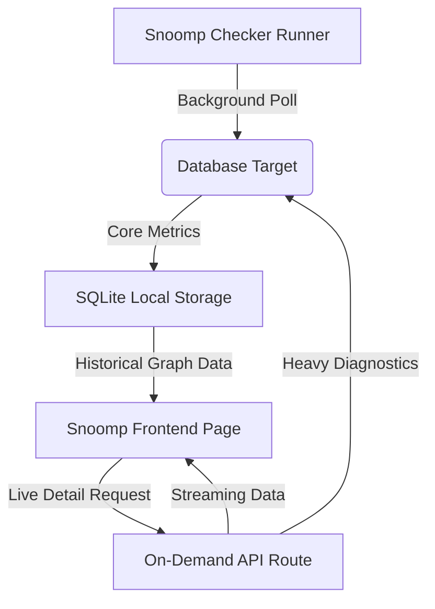

# 2026-07-23 Database Monitoring Design Spec

This document details the architecture, data models, and UI changes to introduce deep database engine monitoring for **PostgreSQL**, **MongoDB**, and **Redis** in Snoomp.

## 1. Goal

Extend Snoomp beyond basic connection status checks by gathering and rendering performance indicators:
- **Throughput**: Queries/Operations per second
- **Connections**: Active client counts
- **Efficiency**: Cache hit rates, memory metrics, and key sizes
- **Diagnostics**: Real-time slow queries, running locks, and server status

---

## 2. Technical Architecture (Hybrid Model)

### A. Background Checkers
Snoomp background worker loops will call custom connection modules:
1. **PostgreSQL**: Queries `pg_stat_database` and `pg_stat_activity`.
2. **MongoDB**: Utilizes PyMongo driver to query `db.command("serverStatus")`.
3. **Redis**: Utilizes Redis driver to call `info()`.

Captured metrics are lightweight floats/ints saved into the local DB to feed 24h-90d history graphs.

### B. Live Engine Diagnostics (REST API)
A REST endpoint `/api/targets/{target_id}/db-engine-status` fetches deep state live:
- **PostgreSQL**: Runs `SELECT query, now() - query_start AS duration FROM pg_stat_activity WHERE state != 'idle'` and tablespace size queries.
- **MongoDB**: Runs `db.command("currentOp")` and `db.command("dbStats")`.
- **Redis**: Runs `SLOWLOG GET 15` and parses memory fragmentation stats.

---

## 3. Database Schema Changes

No major migrations. We will extend the existing `Target` and `Heartbeat`/`Metrics` tables:
- `Target` model:
  - Add connection fields for MongoDB and Redis monitor types.
- `Heartbeat` / `Metrics` models:
  - Store dynamic columns or structured JSON inside `metrics` for database statistics (e.g. `ops_per_sec`, `active_connections`, `cache_hit_ratio`).

---

## 4. UI / UX Design

### A. Monitor Details Page
When a Database monitor is opened, the page structure adapts:
1. **Multi-Series Performance Chart**: Displays:
   - Line 1 (Blue): Operations / Queries per Second
   - Line 2 (Purple): Active Connections / Client Threads
   - Line 3 (Green): Memory Usage or Cache Hit Rate
2. **Tabs layout**:
   - **Performance Chart**: Uptime & throughput history.
   - **Storage & Version Info**: Version string, database size, index sizes, key count.
   - **Active Queries / Slow Logs**: Live-updated table of long-running queries or redis slowlogs.

### B. Modal Form Adaptations
Under Monitor Type, selecting "MongoDB" or "Redis" hides standard Host/Port fields and exposes a single **Connection URI** input field.

---

## 5. Verification Plan

### Automated Tests
- Integration tests simulating PostgreSQL, MongoDB, and Redis targets.
- Verify checker scripts parse connection strings and retrieve metrics successfully.

### Manual Verification
- Adding local Redis and PostgreSQL instances to Snoomp, observing live charts updating.
